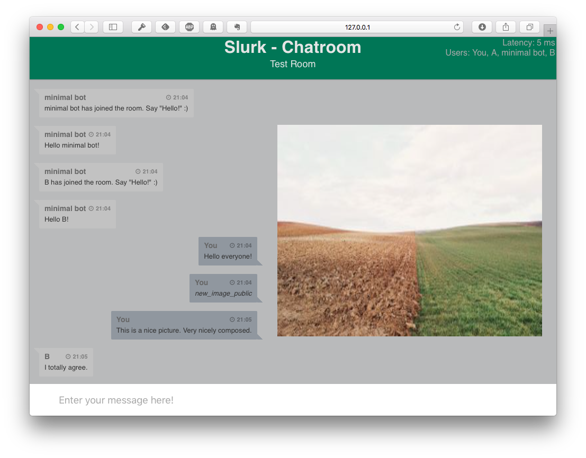

.. _slurk_about:

=========================================
Slurk: What's this?
=========================================

Many fields of research have profited in the last years from the availability, through so-called "crowd working platforms", of a large pool of workers that can do small, web-based tasks. This has helped research in psychology as well as, dramatically so, research in artificial intelligence, where it made possible the collection of large amounts of labeled data from which models can be derived. While the common platforms offer templates for tasks such as image labeling or answering questions, there are no such templates for dialogue tasks, where more than one participant is needed at the same time.

To facilitate web-based dialogue experiments, we built **slurk**. (Think: "slack for mechanical turk"...) Slurk is a chat server onto which human participants, as well as "bots", can log on to interact. Conversations happen in *rooms*, which are closed off to each other: While the server can handle many separate conversations in parallel, a given user will only be in one room and hence in one conversation.

We were specifically interested in multimodal dialogues which involve more than just words. A paradigmatic example for such a type of dialogue would be a discussion about an image that is being shown to the users in a room. To enable such a setting, we distinguish in the interface presented to users between what we call the *display area*, where some media (e.g., an image) can be displayed, and the *chat* and *input* area, in which the chat history is shown and the user's utterance is being composed, respectively. This display area can be controlled by a bot, which might cause the display to change in response to what was said. Bots in slurk have far-reaching control over what human users in a room can type and over what they can see. This provides a way to specify and control a dialogue task programmatically.

.. _screenshot_image:

   An example with two human users, one bot, and an image being shown in the display area

Some basic concepts
~~~~~~~~~~~~~~~~~~~~

Bots
  Bots are little client programs (written in python, and connecting to the slurk server via `socket.io`) that can
  enter rooms as well. They can both interact with human clients (e.g. through text messages or images) and communicate
  with the server by sending commands and responding to socket events. Unlike human users, bots can be in several rooms,
  being responsible for handling certain dialogue *tasks*. Defining an experimental or data collection setting typically
  includes writing one or multiple bots.

Rooms
  Rooms are collections of users (humans and bots) that can talk to each other. Human users are always in exactly one
  room. The concierge example bot provides the **Waiting Room**, where users wait until a pre-determined number of members
  is reached (let's say, 2), in which case all members are moved to a newly created task-specific room.

Technical concepts
  **Events**: Slurk is driven by events emitted by the server. All events have a certain type and corresponding
  information, which can be processed by bots and client-side scripts.

  **API**: Bots can communicate with the server using a :ref:`slurk_api`, causing the server to emit corresponding
  events. For instance, they can be used to create rooms, connect or disconnect clients or generate tokens for logging
  in.

  **Commands**: is basically the same as a public text message, but is only sent to the users with the required
  permissions.

  **Tokens**: To provide control over who is allowed to log into the chat (since we're not interested in running a
  public server here), access is regulated via tokens. Tokens need to be created in advance and link a user (who is
  logging in with the token) to a specific task/room type.

A simple experiment
~~~~~~~~~~~~~~~~~~~

For experiments, we want to invite users to task-specific rooms. Users can participate via tokens which serve as the
password during the login. When users open the slurk URL, then they will see a login screen initially. Here users
are allowed to give themselves a name and they must insert the token. The user will then be newly created in the database.

The user will be automatically transferred to the room for which the token was generated. Therefore, we have to create
an experiment room before we can generate tokens for an experiment. The sequence is: ``rooms -> tokens -> users``.
Bots also can also be represented as users. For this purpose, they can send a ``Name`` header.
