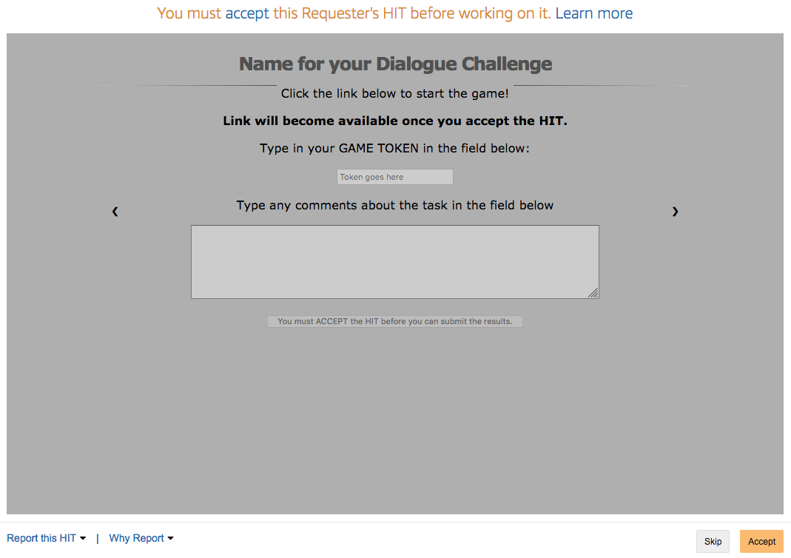
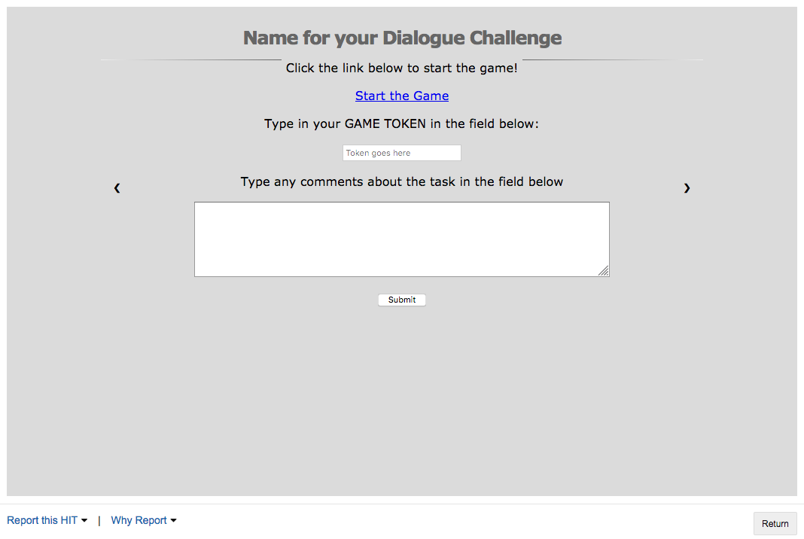

.. _slurk_amt:

=================================================
Getting participants from Amazon Mechanical Turk
=================================================

The main purpose of Slurk is to allow collection of big data on crowd sourcing platforms such as Amazon
Mechanical Turk (AMT). In this section we will explain how to use Slurk's functionality in order to publish
human intelligence tasks (HITs) on AMT, retrieve results and metadata about AMT workers, accept or reject submitted tasks,
and send payments taking into account dialogue data stored in Slurk.

The process behind transferring data from AMT to Slurk can be presented as a scheme on the image below.

.. figure:: slurk_amt.png
   :align: center
   :scale: 60 %

   Slurk-AMT integration

Basically, with each HIT we publish a link, which allows workers to enter Slurk.
These links can be used multiple times, guaranteeing that if worker decides to return the task,
it will be accessible for the others to complete. Also it significantly reduces amount of time spent for
the analysis of returned HITs, since they can be simply ignored because they were never completed.

Before publishing our tasks on AMT, we activate Slurk along with two bots: the concierge bot and the task bot.
Their task is monitor activity of workers joining the rooms, and move them between rooms,
issue commands, etc.

Once player clicks the link, a new browser window opens with Slurk in it. After the task is completed,
Slurk stores data corresponding to the concrete room in a separate .log file. Information about login tokens
is stored in the MySQL database, which can be used to, for example, invalidate links, which are used by
malicious players to enter Slurk outside of AMT. With this, we make sure that retrieved data cannot be harmed
in any way.

Building and Publishing HITs
~~~~~~~~~~~~~~~~~~~~~~~~~~~~

In AMT setting, requester (HIT publisher) needs to specify the format that will be used to display HITs to workers.
Slurk uses HTMLQuestion scheme [1]_ as it allows requesters to have more control over the data collection, putting less
efforts into the process of embedding application with AMT.
In your XML template you will have to specify structure of your task. It can be a slideshow, a simple HTML webpage with the list
of instructions, or even a video.

Each HIT must have meta information: title, author, description, reward, lifetime in seconds, etc.
These parameters are visible to the workers and can significantly speed up your data collection process.
For example, imagine that you want to restrict access to your tasks for players, who might provide you with low quality data.
Along with meta information, you would pass one Qualification Requirement to AMT, making your HITs available for preview/acceptance
only to those workers who completed 5000 or more HITs. Such qualification would most likely increase the quality of your data.

In the case of Slurk, it is important to make sure that each of your HITs contains link to access the application.
This link is not presented to the workers when previewing the HIT, and becomes visible once they accept the task.
Links have to be generated with the separate Python script, that accesses your running Slurk application, and generates as many links
as you want to have for your task.
Each link is later embedded into the HTML of a HIT webpage, and also can be non-/visible depending on the situation.
In particular, if worker decides to preview the HIT, he will see the following on the display:

   HIT Preview page for Slurk

Once the HIT accepted, game link is displayed to the player:

   HIT Accept page for Slurk

Given Slurk, meta information and XML structure of your HITs along with qualification requirements, you can publish your tasks on
either AMT Sandbox (testing environment on AMT) or AMT itself.

Reviewing HITs, Extracting data
~~~~~~~~~~~~~~~~~~~~~~~~~~~~~~~~~~~~~~~~

As Figures above indicate, players are required to type a special game token into the respective field.
This game token is produced by the bots, and allows you to associate a worker with the provided data.
Slurk is also able to store dialogues in the format of logs along with the MySQL database, which contains
information about all elements of the game (tokens, users, etc.). Here we will briefly describe how we analyse
received data and what it contains.

In general, players get a game token in the Waiting Room if they were not paired up with another worker.
It helps us to differentiate between workers who actually participated in the dialogue task and those, who were only waiting
for someone to join the game:

.. figure:: token_wb.png
   :align: center
   :scale: 60 %

Upon task completion, players also receive a special game token, which indicates that they have completed the task.

.. figure:: token_gm.png
   :align: center
   :scale: 75 %

These tokens are stored in the log files, which contain all information about the game process. The structure of
logs in Slurk is build in .json format. Each event (sending images or messages, issuing commands) is stored as a
separate dictionary inside the log file. Slurk is able to track rooms and players along with the type of event (joining,
sending, etc.) and timestamps. Some of these messages contain a game token that has been given to the workers.
In order to pay for their job, we compare these tokens in the log files with the tokens which were submitted to AMT.

It is nature of your task that defines what you have to consider when paying for your HITs. You can rely on time workers spent in the room
until the token has been sent to them, or even on the number of utterances which were produced in a dialogue: all of these elements
can be wrapped up, and with the help of AMT API used to define the amount of (bonus) payment.

In the end we have all necessary elements for analysing our data: log files and database with information about players and tokens.
Additionally, with the help of several simple scripts, we are able to pay workers depending on the game token that they have submitted.

---------------------------------------------------------------------------

.. [1] For more information on AMT HTMLQuestion Data Scheme, please visit `the official documentation <https://docs.aws.amazon.com/AWSMechTurk/latest/AWSMturkAPI/ApiReference_HTMLQuestionArticle.html>`_.
