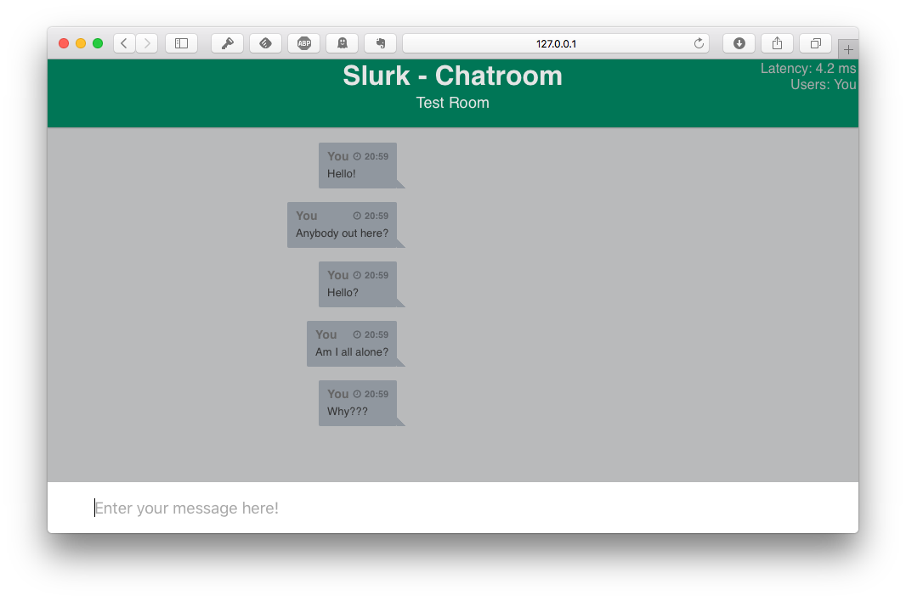

.. _slurk_gettingstarted:

=========================================
Getting Started
=========================================

"Hello World": A basic test of the server
~~~~~~~~~~~~~~~~~~~~~~~~~~~~~~~~~~~~~~~~~

First, spin up a slurk server. Either use the server from :ref:`slurk_prerequisites` or see :ref:`slurk_deployment` for more information on this.

Next, the admin token is needed. If you are running slurk from docker, run:

.. code-block:: bash

  $ export SLURK_TOKEN=$(scripts/read_admin_token.sh)
  $ echo $SLURK_TOKEN
  01234567-89ab-cdef-0123-456789abcdef

Otherwise, assign it:

.. code-block:: bash

  $ export SLURK_TOKEN=01234567-89ab-cdef-0123-456789abcdef

The token is exported so subsequent scripts can read the token. All scripts are using the :ref:`slurk_api` internally.

Create a room as the landing page for our new token. In order to create a room,
we need a layout for the room. We use a default layout provided by slurk:

.. code-block:: bash

   $ scripts/create_layout.sh examples/simple_layout.json

This will return the layout with all its settings, only the id is needed:

.. code-block:: bash

   $ LAYOUT_ID=$(scripts/create_layout.sh examples/simple_layout.json | jq .id)
   $ echo $LAYOUT_ID
   2

With the layout provided, we can create the actual room:

.. code-block:: bash

   $ ROOM_ID=$(scripts/create_room.sh $LAYOUT_ID | jq .id)
   $ echo $ROOM_ID
   1

To log into the room, a token has to be generated:

.. code-block:: bash

  $ TOKEN=$(scripts/create_room_token.sh $ROOM_ID examples/message_permissions.json | jq -r .id)
  $ echo $TOKEN
  fedcba98-7654-3210-fedc-ba9876543210

Now visit your server (e.g. http://localhost:5000) and enter whatever name you like and the token
you just generated, and click "enter chatroom".

This should transport you to the chat interface, where you then can
happily type messages which no one will see (apart from you, that is).

.. _screenshot_void:

   A single user talking to no one in particular

This has confirmed that the server is working correctly, but so far
this hasn't really been very exciting. So we move on.

.. _twobrowsers:

"Hello World" -- "Hello Other Browser": Testing with two browsers
~~~~~~~~~~~~~~~~~~~~~~~~~~~~~~~~~~~~~~~~~~~~~~~~~~~~~~~~~~~~~~~~~

Run the steps from the previous section (starting the server, creating
a token and logging in), and then create an additional token by
running the create_token script with the same parameters again. **From
a different web browser or in a private tab**, log in with that
token. You should now see both identities in the respective chat
windows, and you should be able to talk with your two selves across
these browsers. Hurray!

(If your machine is set up in the right way [that is, the machine that
is localhost is accessible from your network], this might work across
machines, and so you can have a chat with an actual distinct person.)

This has demonstrated the very basic capabilities – providing a chat
environment – but so far there has been no use made of the display
window. Let's change that by inviting a bot into our chat room.

Chatting with a bot
~~~~~~~~~~~~~~~~~~~

Without additional environment variables, the server uses an in-memory
database and resets on every restart of the server. If you restarted the
server, make sure you have created the layout and the room.

For the bot, more permissions are needed. Create a file where the
permissions are set:

.. code-block:: bash

  $ cat bot-permissions.json
  {
      "api": true,
      "send_message": true,
      "send_image": true,
      "send_privately": true
   }

Now create the token and a user for the bot:

.. code-block:: bash

  $ BOT_TOKEN=$(scripts/create_room_token.sh $ROOM_ID bot-permissions.json | jq -r .id)
  $ echo $BOT_TOKEN
  45670123-cdef-89ab-4567-012389abcdef
  $ BOT_USER=$(scripts/create_user.sh 'Echo Bot' $BOT_TOKEN | jq -r .id)
  $ echo $BOT_USER
  2

There are several bots available at `GitHub <https://github.com/clp-research/slurk-bots>`_,
in our example the echo-bot is used. Start the bot with the provided token

.. code-block:: bash

   $ docker run -e SLURK_TOKEN=$BOT_TOKEN -e SLURK_USER=$BOT_USER -e SLURK_PORT=5000 --net=host slurk/echo-bot

After the bot has logged in, you can chat with yourself.

.. _screenshot_void:
.. figure:: echo-bot.png
   :align: center
   :scale: 25%

   Chatting with myself

Examining the log files
~~~~~~~~~~~~~~~~~~~~~~~

The point of all this, however, is not just to make interaction
*possible*, it is to *record* these interactions to be able to later
study them or train models on them.

In order to read the logs for our room, run:

.. code-block:: bash

   $ scripts/get_logs.sh $ROOM_ID | jq

The returned data contains, as a JSON list, most of the events that
the server handled, including all the messages that were sent. This
should contain the information that you need for your particular
purposes.

This concludes the quick start. We now can be reasonably confident
that the setup is working on your machine; you also got a first
introduction to the basic concepts. But what we have seen so far would
only allow us to run a single room at a time. That may already be all
you want if you conduct experiments locally with participants that you
bring into the lab. If you want to make use of crowdsourcing, though,
you will want to be able to automatically pair up participants and
create task rooms for each pair. This will be explained in the next
section.
