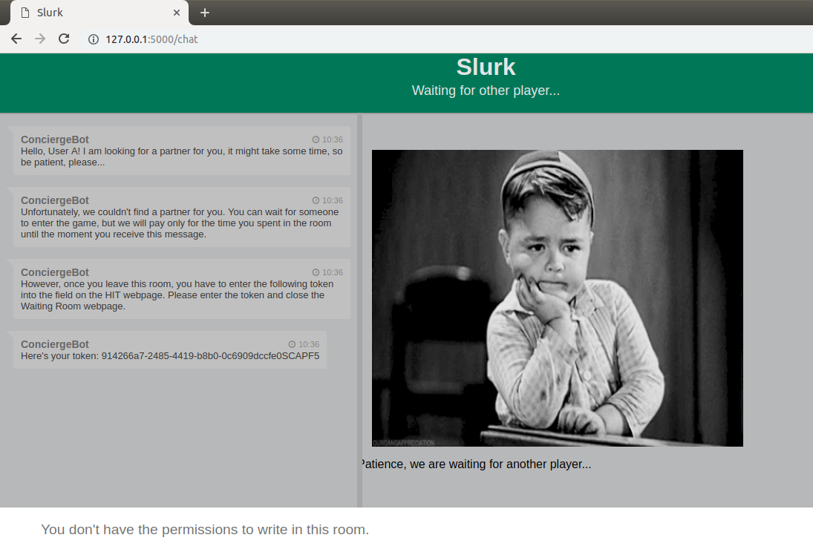
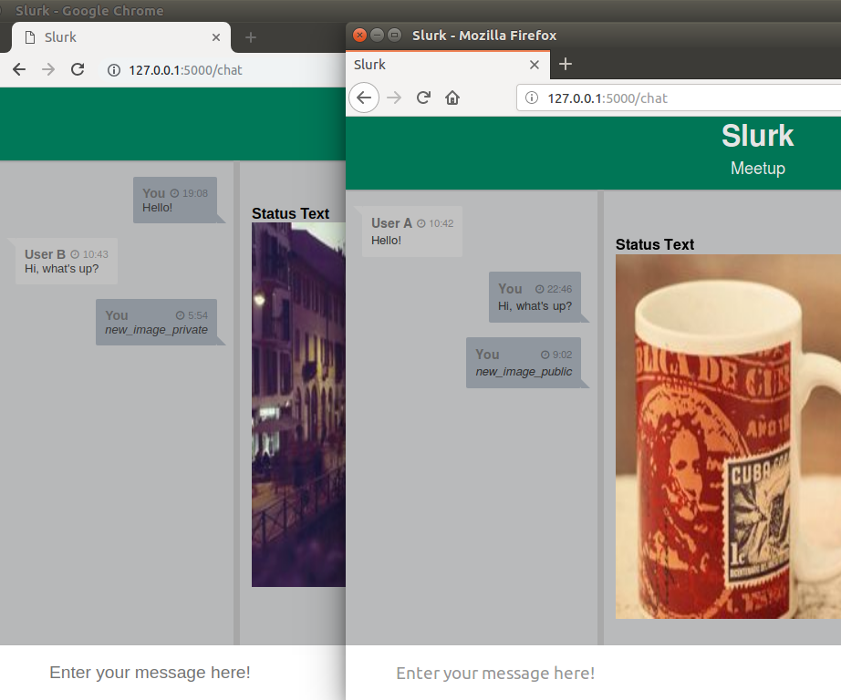

.. _slurk_multibots:

Pairing up participants and running multiple rooms (and bots)
=============================================================

In the following steps you will learn how to let bots and human users enter the slurk waiting room where users will be paired up and put into a new task-specific chatroom along with bots. The bot handling this mechanism (moving human users and other bots from the waiting room to the taskroom) is the **pairup bot**. You can find it in the *sample_bots* directory.

Again, we will start the chat server in development mode and assume that you will use the default values in the config.ini, serving slurk on http://127.0.0.1:5000.

First, we need to log in the bots and then the users.

**Step 1:** 

  Open a terminal window and start slurk:

    ``python chat.py``

**Step 2:**

  Go to http://127.0.0.1:5000/token and fill in the following:

    - Source:  *can be anything*
    - Room:    Waiting Room
    - Task:    None
    - Count:   2	
    - Key:     *the secret key you've defined in the config.ini*
   
  Press "Generate tokens".

  Now you have two tokens. One token will be used for the pairup bot (*Step 3*) and the other one for the multi bot (*Step 4*). The multi bot serves as an example bot here which will join the users in the taskroom later.
   
**Step 3:**

 Open a new terminal window and run the **pairup bot**:

   ``python sample_bots/pairup_bot.py *token*``

 Replace \*token\* with the first token created in *Step 2*. The pairup bot will enter the waiting room now. You will see a confirmation of this in the terminal window where you started the chat server:
 
    ``ConciergeBot joined room: Waiting Room``
    
 *ConciergeBot* is the name of the pairup bot.

**Step 4:**
 
 Open a third terminal window and run the **multi bot**:

  ``python sample_bots/multi_bot.py *token*``

 where \*token\* is to be replaced by the second token created in *Step 2*. The multi bot is also in the waiting room now. Check for confirmation in the terminal window:

    ``MultiBot joined room: Waiting Room``
 
 All required bots are registered. In the next steps we need to log in the users.

**Step 5:**

  Open http://127.0.0.1:5000/token again and fill in the following:

    - Source:  *can be anything*
    - Room:    Waiting Room
    - Task:    meetup
    - Count:   2	
    - Key:     *the secret key you've defined in the config.ini*

  Press "Generate tokens". You will see two tokens.

**Step 6:**

  Open http://127.0.0.1:5000 in a new tab. Fill the first field with a username and the second field with one of the tokens created in *Step 5*. Press "Enter Chatroom". The user will join the waiting room. Next we need a second user.
  
.. _screenshot_void:

   A single user in the waiting room, waiting for another player to join

**Step 7:**

  Open http://127.0.0.1:5000 again, but this time in a **different browser**. Fill the first field with a username and the second field with the other token from *Step 5*. Press "Enter Chatroom".

With two participants being present in the waiting room now the *pairup bot* will open a new chatroom. Both users will be removed from the waiting room and put into the newly created taskroom together with the *multi bot*. Now the users and the multi bot can interact with each other, e.g. you can use the commands **/new_image_private** and **/new_image_public** in the chatroom to see this in action.

.. _screenshot_privimage:

   Two users interacting in the taskroom

*Notice:* While the two users need to leave the waiting room in order to enter the taskroom, the multi bot remains in the waiting room and can join as many chatrooms as needed from there. This means: the multi bot (or bots in general) can exist in multiple rooms simultaneously whereas human users can only be present in one room.
