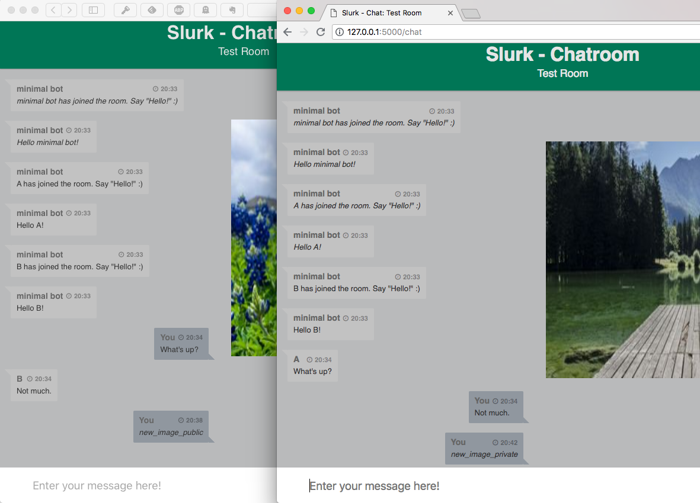

.. _slurk_quickstart:

=========================================
Quickstart
=========================================

"Hello World": A basic test of the server
~~~~~~~~~~~~~~~~~~~~~~~~~~~~~~~~~~~~~~~~~

Start *slurk* with:

- `python chat.py`

This will start the flask server in development mode. You will later learn how to start a production server.

In the following, we will assume that you used the defaults in `config.ini` so that the app is served on localhost port 5000 (`127.0.0.1:5000`).

If you now go to http://127.0.0.1:5000, you should see the login window, asking for two items, prefilled with "Name" and "None". The first asks for a name under which you will be identified in the chat, and the second asks for a token.. which you don't have yet.

To get a token, you will need to generate one by going to http://127.0.0.1:5000/token. On that page, fill in the fields as follows:

- Source: *can be anything*
- Room: Test Room
- Task: None
- Count: 1
- Key: *the secret key you've defined in the config.ini*

(Note: What is happening behind the curtain is that entries are created in the user database, with attributes as specified here. `Room` fixes where the user that is logging in with the created token starts, `Task` specifies the tasks that this user is allowed to do, and `Count` creates as many tokens. `Source` doesn't really have a function at the moment; any string will do here.)
  
After you submit this form, you should see a long alphanumeric string as a response. Copy this string (the token) over to the login page. Enter whatever Name you like and this copied token, and click "enter chatroom".

This should transport you to the chat interface, where you then can happily type messages which no one will see (apart from you, that is).

.. _screenshot_void:
.. figure:: single_user.png
   :align: center
   :scale: 60 %

   A single user talking to no one in particular

This has confirmed that the server is working correctly, but so far this hasn't really been very exciting. So we move on.

(But one additional thing before we move on: If you repeat the steps above while keeping the chat server alive, you will notice that you will end up in the same room which shows the chat history of the previously created user which now however is orphaned, as you have your new identity. The reason for that is the websocket connection that is created by the server is tied to the browser, and was kept alive. If you want to start fresh, you need to kill the chat server and restart again.)

TODO: Double check. Is that true? Or is there another way to start with a fresh empty test room w/o killing the chat server?

.. _twobrowsers: 

"Hello World" -- "Hello Other Browser": Testing with two browsers
~~~~~~~~~~~~~~~~~~~~~~~~~~~~~~~~~~~~~~~~~~~~~~~~~~~~~~~~~~~~~~~~~

Run the steps from the previous section (starting the server, creating a token and logging in), and then create an addtional token and, **from a different web browser**, log in with that token. You should now see both identities in the respective chat windows, and you should be able to talk with your two selves across these browsers. Hurray!

(If your machine is set up in the right way [that is, the machine that is localhost is accessible from your network], this might work across machines, and so you can have a chat with an actual different person.)

This has demonstrated the very basic capabilities -- providing a chat environment --, but so far there hasn't been any use made of the display window. Let's change that by inviting a bot into our chat room.

Chatting with a bot, and giving commands
~~~~~~~~~~~~~~~~~~~~~~~~~~~~~~~~~~~~~~~~

Kill the server (if it's still running) and start it again:

- `python chat.py`

Now before we log onto the server in the way described above, let us create a bot user and let it log on first.

Bots also need tokens. Let us directly create all tokens we need. Go to http://127.0.0.1:5000/token, and fill in:

- Source: *can be anything*
- Room: Test Room
- Task: None
- Count: 1
- Key: *the secret key you've defined in the config.ini*

That is, we create three tokens in one go.

Copy the first one, and use it to do the following, in a new terminal window (`minimal.py` lives in `sample_bots`):

- `python minimal.py` *<TOKEN>*

In the terminal window where you started the chat server, you should see a message stating that `minimal bot has connected`. In the window of the chat bot, you will see some JSON structures. These structures contain several pieces of information, for example about the room and the user. They are needed to keep track of all events and to emit data to the right room or user. You can access all the information with the help of the predefined commands in the bots, e.g.:

    .. code-block:: python
    
      def on_message(self, data):
          print("on_message", data)
        
where *data*, in this case, holds information about the user that sends a text, about the rooms that are involved and of course the text message itself (see *minimal.py*). Depending on which command you are using the contents of the JSON structures may vary.

Now start two browsers and log in as two different users (let's call them `A` and `B`), as described above in :ref:`twobrowsers`. The list of users in the top right corner of the window should now indicate that besides `A` and `B` there is also a user called `minimal bot`.

So far, nothing else has changed really. (Except that you now get a glimpse of what's happening behind the scenes, as the `minimal bot` prints all messages that pass through the room to its `STDOUT` [i.e., into the terminal window where it was started].)

But now that the bot is in the room, we can issue *slash commands* to it. Try the  following in `A`'s chat (the leading `/` is important):

- `/new_image_public`

You should notice three things:

- In both chat windows, an image has appeared in the display area (which up to now has been empty).
- In `A`'s chat history, the command is shown in italics.
- In `B`'s chat history, the command is not shown at all.

This demonstrates some important features of slurk and the interaction with bots: Bots can react to commands; the interaction between a user and the bot is private by default; and bots can control the display area.

Now type the following, as `B` for a change:

- `/new_image_private`

Now only the image shown for `B` should have changed and you should be seeing something similar to :numref:`screenshot_privimage`. This demonstrates another important feature: the display area can be controlled per user; that is, different users can be shown different material in that area. This makes it possible to set up tasks where the users may not in fact be seeing the same image.

.. _screenshot_privimage:

   Example interaction with the minimal bot

Examining the log files
~~~~~~~~~~~~~~~~~~~~~~~

The point of all this, however, is not just to make interaction *possible*, it is to *record* these interactions to be able to later study them or train models on them. In the directory `log/` where you started the chat server, you should now find logfiles, named with the time stamp and the name of the room. These files contain, as a JSON list, most of the events that the server handled, including all the messages that were sent. This should contain the information that you need for your particular purposes.

TODO: Provide example script that extracts the utterances in a parlAI style representation?

This concludes the quick start. We now can be reasonably confident that the setup is working on your machine; and you also got a first introduction to the basic concepts. But what we have seen so far would only allow us to run a single room at a time. That may already be all you want if you conduct experiments locally with participants that you bring into the lab. If you want to make use of crowdsourcing, though, you will want to be able to automatically pair up participants and create task rooms for each pair. This will be explained in the next section.
